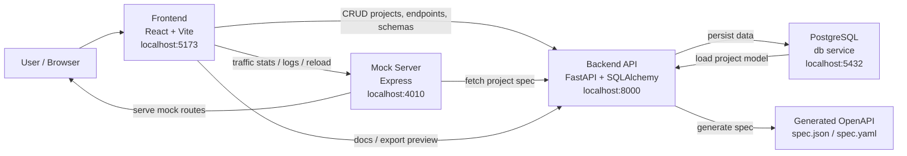

# APIBlueprint

APIBlueprint is a full-stack API design studio for modeling REST endpoints,
storing them in PostgreSQL, generating OpenAPI specs, serving dynamic mock
routes, and keeping documentation, monitoring, and export views tied to the
same project data.

## What It Does

- Create API projects from the UI
- Define endpoints, parameters, and example responses
- Build reusable schemas with nested fields
- Generate OpenAPI JSON and YAML from stored project data
- Serve spec-driven mock endpoints through a separate mock server
- Inspect live documentation, export previews, and mock traffic from the same project

## System Architecture



## Runtime Flow

1. You model a project in the frontend.
2. The frontend saves projects, endpoints, parameters, responses, and schemas through the FastAPI backend.
3. The backend stores that data in PostgreSQL.
4. The backend generates OpenAPI output from the stored model on demand.
5. The mock server pulls that generated spec and uses it to serve example responses.
6. Documentation, monitoring, and export all read from the same underlying project state, so the app behaves like one connected system instead of separate demos.

## Stack

- Frontend: React, Vite
- Backend: FastAPI, SQLAlchemy, Pydantic
- Database: PostgreSQL
- Mock layer: Express
- Migrations: Alembic
- Local orchestration: Docker Compose

## Services

| Service | Port | Purpose |
| --- | --- | --- |
| `frontend` | `5173` | Main UI for dashboard, editor, schemas, docs, monitoring, and export |
| `backend` | `8000` | CRUD API plus OpenAPI spec generation |
| `mock` | `4010` | Spec-driven mock routes, logs, stats, and reload endpoint |
| `db` | `5432` | PostgreSQL persistence |

## Quick Start With Docker

1. Copy the environment file:

```bash
cp .env.example .env
```

2. Build and start the stack:

```bash
docker compose up --build -d
```

3. Open the app:

- Frontend: [http://localhost:5173](http://localhost:5173)
- Backend docs: [http://localhost:8000/docs](http://localhost:8000/docs)
- Backend health: [http://localhost:8000/health](http://localhost:8000/health)
- Mock health: [http://localhost:4010/health](http://localhost:4010/health)

## Important Docker Commands

Start:

```bash
docker compose up --build -d
```

Stop:

```bash
docker compose down
```

View status:

```bash
docker compose ps
```

View logs:

```bash
docker compose logs -f backend
docker compose logs -f frontend
docker compose logs -f mock
```

Rebuild after code changes:

```bash
docker compose up --build -d
```

## Environment Variables

Docker Compose reads values from the root `.env` file. Copy [.env.example](.env.example)
to `.env` to get started with the default local setup.

Most important variables:

| Variable | Purpose |
| --- | --- |
| `POSTGRES_USER`, `POSTGRES_PASSWORD`, `POSTGRES_DB` | Database credentials |
| `POSTGRES_PORT` | Exposed PostgreSQL port |
| `BACKEND_PORT`, `FRONTEND_PORT`, `MOCK_PORT` | Exposed service ports |
| `DATABASE_URL` | SQLAlchemy connection string |
| `CORS_ORIGINS` | Allowed frontend origins for FastAPI — must be a valid JSON array string, e.g. `["http://localhost:5173"]` |
| `BACKEND_URL` | Backend URL used by the mock server |
| `VITE_API_URL` | Frontend-to-backend API base URL |
| `VITE_MOCK_URL` | Frontend-to-mock API base URL |

## Migrations

This project uses Alembic instead of startup `create_all`.

Important behavior:

- The backend container runs `alembic upgrade head` automatically before starting Uvicorn.
- The backend startup script also handles legacy local databases by stamping the current schema if app tables already exist but `alembic_version` does not.

Relevant files:

- [backend/start.sh](backend/start.sh)
- [backend/alembic.ini](backend/alembic.ini)
- [backend/alembic/](backend/alembic/)

Run migrations manually in local backend development:

```bash
cd backend
alembic upgrade head
```

Check current revision:

```bash
cd backend
alembic current
```

## Local Development Without Docker

### Backend

```bash
cd backend
python3 -m venv .venv
source .venv/bin/activate
pip install -r requirements.txt
alembic upgrade head
uvicorn app.main:app --reload
```

### Frontend

```bash
cd frontend
npm install
npm run dev
```

### Mock server

```bash
cd mock
npm install
node server.js
```

If you run services manually, make sure `DATABASE_URL`, `VITE_API_URL`, and
`VITE_MOCK_URL` all point to the right local services.

## Main Product Surfaces

### Dashboard

- Create and open API projects
- View project summaries and endpoint counts

### Endpoints

- Create endpoints manually
- Edit method, path, summary, tag, and description
- Add parameters and example responses
- Auto-suggest safer `operation_id` values from method plus path

### Schema Builder

- Create reusable schemas
- Model nested object fields
- Persist schema fields into generated OpenAPI components

### Documentation

- View project-scoped API docs from stored endpoint data
- Inspect example requests and responses

### Monitoring

- Inspect mock request logs
- See per-project traffic stats and route activity
- Reload mock routes after endpoint changes

### Export

- View OpenAPI YAML
- Preview generated SDK snippets
- Inspect mock base URL and traffic context

## Backend API Overview

### Health

- `GET /health`

### Projects

- `GET /api/projects`
- `POST /api/projects`
- `GET /api/projects/{project_id}`
- `PUT /api/projects/{project_id}`
- `DELETE /api/projects/{project_id}`

### Endpoints

- `GET /api/projects/{project_id}/endpoints`
- `POST /api/projects/{project_id}/endpoints`
- `GET /api/endpoints/{endpoint_id}`
- `PUT /api/endpoints/{endpoint_id}`
- `DELETE /api/endpoints/{endpoint_id}`

### Parameters

- `POST /api/endpoints/{endpoint_id}/parameters`
- `PUT /api/parameters/{param_id}`
- `DELETE /api/parameters/{param_id}`

### Responses

- `POST /api/endpoints/{endpoint_id}/responses`
- `PUT /api/responses/{response_id}`
- `DELETE /api/responses/{response_id}`

### Schemas

- `GET /api/projects/{project_id}/schemas`
- `POST /api/projects/{project_id}/schemas`
- `DELETE /api/schemas/{schema_id}`
- `POST /api/schemas/{schema_id}/fields`
- `DELETE /api/fields/{field_id}`

### Specs

- `GET /api/projects/{project_id}/spec`
- `GET /api/projects/{project_id}/spec.json`

### Mock server utilities

- `GET /mock-logs`
- `GET /mock-stats`
- `POST /mock/reload/{project_id}`
- `ANY /mock/{project_id}/*`

## Example Manual Test Flow

1. Create a project on the Dashboard.
2. Add one endpoint in the editor.
3. Add parameters and a valid JSON response example.
4. Open Documentation and verify the route is rendered.
5. Call the mock URL from the curl example.
6. Open Monitoring and confirm the request appears in logs.
7. Open Export and confirm the YAML and SDK preview include the endpoint.

## Testing

Frontend build:

```bash
cd frontend
npm run build
```

Backend smoke tests:

```bash
docker compose exec backend python -m unittest discover -s tests -v
```

Host-side backend smoke tests also work if your local Python environment has the
backend dependencies installed:

```bash
python3 -m unittest discover -s backend/tests -v
```

## Troubleshooting

### Backend keeps restarting

Check logs first:

```bash
docker compose logs backend --tail 100
```

### Mock route returns 404

- Make sure the endpoint exists in the selected project
- Reload mock routes from Monitoring or call:

```bash
curl -X POST http://localhost:4010/mock/reload/<project_id>
```

### Response example fails to save

- The response example must be valid JSON
- Use double quotes for strings
- Check for missing commas or trailing commas

### Want a clean local reset

This removes the database volume:

```bash
docker compose down -v
docker compose up --build -d
```

Use that only if you are okay losing local data.

## Project Structure

```text
apiblueprint/
├── backend/
│   ├── alembic/
│   ├── app/
│   │   ├── core/
│   │   ├── models/
│   │   └── routes/
│   ├── alembic.ini
│   ├── start.sh
│   ├── tests/
│   └── Dockerfile
├── frontend/
│   ├── src/
│   ├── package.json
│   └── Dockerfile
├── mock/
│   ├── server.js
│   ├── package.json
│   └── Dockerfile
├── docker-compose.yml
├── .env.example
└── README.md
```