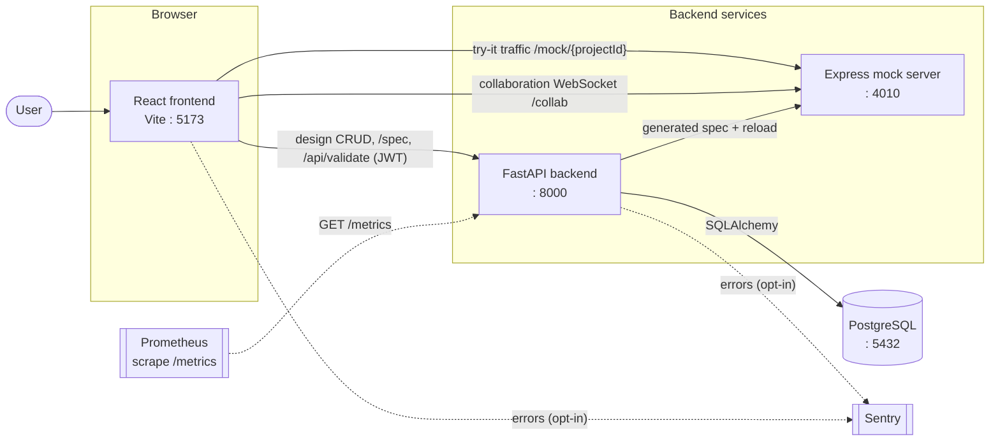

# Architecture

APIBlueprint is a multi-service system for designing, documenting, and trying
REST APIs. See [ADR-001](decisions/ADR-001-dual-backend.md) for why there are
two backend services.

## Services

| Service | Stack | Port | Responsibility |
| --- | --- | --- | --- |
| **frontend** | React + Vite | 5173 | Visual API designer, spec/SDK export, monitoring UI |
| **backend** | FastAPI (Python) | 8000 | System of record: CRUD, spec generation + validation, auth, observability |
| **mock** | Express (Node.js) | 4010 | Schema-aware mock of each project's designed API (`/mock/{projectId}`) + collaboration WebSocket (`/collab`) |
| **postgres** | PostgreSQL | 5432 | Persistence for projects, endpoints, schemas |

## Component & data flow

## Request lifecycle (backend)

Every backend request passes through a middleware stack (outermost first):

1. **Trace context** — assigns/echoes `X-Request-ID` (`trace_id`), binds it into
   all structured logs, and stamps `X-Response-Time`.
2. **CORS** — environment-specific allowed origins.
3. **GZip** — compresses responses over `GZIP_MIN_SIZE_BYTES`.
4. **Security headers** — `X-Content-Type-Options`, `X-Frame-Options`, HSTS (HTTPS).
5. **Idempotency** — replays the first response for a repeated `Idempotency-Key` POST.
6. **Request-size limit** — rejects bodies over `MAX_REQUEST_BODY_SIZE_MB`.
7. **Rate limiting** — per-IP via SlowAPI.

Errors are returned as a consistent envelope: `{ "error": { code, message, trace_id } }`.
A catch-all handler guarantees unexpected failures return that envelope rather
than leaking a traceback.

## Spec generation

`GET /api/v1/projects/{id}/spec[.json]` loads the project graph
(endpoints → parameters/responses, schemas → fields) with eager loading to avoid
N+1 queries, then walks it into an OpenAPI 3.0 document. The same document can be
checked with the standalone validator at `POST /api/validate`.

## Observability & reliability

Structured JSON logs carry `trace_id`; Prometheus metrics are exposed at
`/metrics`; errors flow to Sentry when a DSN is configured. Reliability targets
and the uptime-monitoring setup are in [slo.md](slo.md).

## Local orchestration

`docker compose up --build` starts all four services. Published ports bind to
`127.0.0.1` by default, so the stack is only reachable from the local machine
unless the compose file is changed. See [DEPLOYMENT.md](../DEPLOYMENT.md).
